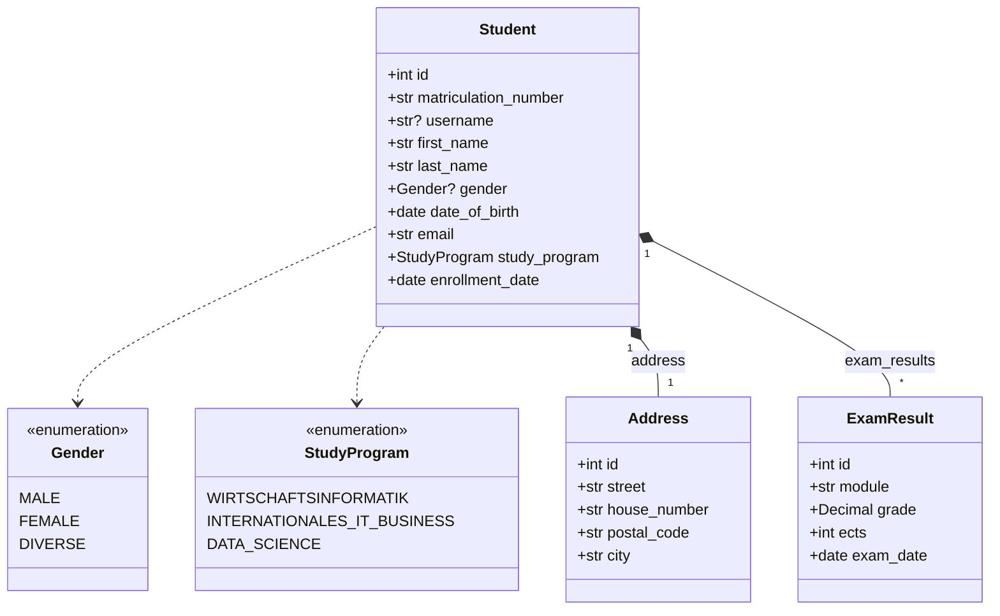

# Student Domain Model

```mermaid
classDiagram
    class Student {
        +int id
        +str matriculation_number
        +str? username
        +str first_name
        +str last_name
        +Gender? gender
        +date date_of_birth
        +str email
        +StudyProgram study_program
        +date enrollment_date
    }
    class Address {
        +int id
        +str street
        +str house_number
        +str postal_code
        +str city
    }
    class ExamResult {
        +int id
        +str module
        +Decimal grade
        +int ects
        +date exam_date
    }
    class StudyProgram {
        <<enumeration>>
        WIRTSCHAFTSINFORMATIK
        INTERNATIONALES_IT_BUSINESS
        DATA_SCIENCE
    }
    class Gender {
        <<enumeration>>
        MALE
        FEMALE
        DIVERSE
    }
    Student ..> Gender
    Student ..> StudyProgram
    Student "1" *-- "1" Address : address
    Student "1" *-- "*" ExamResult : exam_results
```
